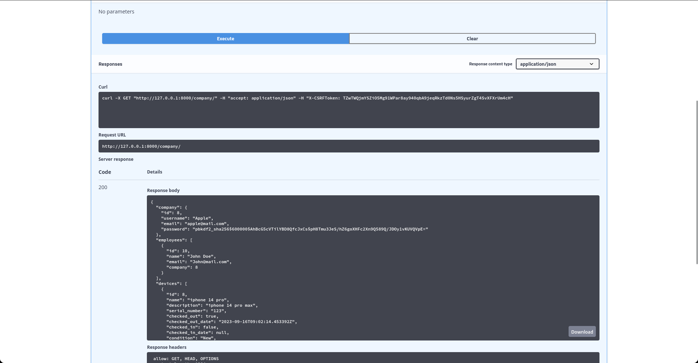

# <h1 align="center">Corporate Asset Tracking API</h1>


## Overview

This Django application is designed to track corporate assets such as phones, tablets, laptops, and other equipment provided to employees. It supports multiple companies, allowing each company to manage its employees, devices, and asset assignments.

## Features

1. Company Management: Companies can register and manage their information.
2. Employee Management: Companies can add and manage their employees.
3. Device Management: Devices (e.g., phones, tablets) can be registered and tracked.
4. Asset Assignment: Assign devices to employees for a specified period.
5. Device Condition Logging: Log the condition of devices during assignment and return.

## Installation
Clone the repository:

```
git clone https://github.com/Eth3R-One/asset-tracking-rest-api.git
```


Create a virtual environment:
```
python3 -m venv env
```
Activate virtual environment:


```
source env/bin/activate
```

On Windows, use: 
```
env\Scripts\activate
```

Install dependencies:

```
pip install -r requirements.txt
```

Apply database migrations:
```
python manage.py migrate
```


Create a superuser (to access the admin panel):

```
python manage.py createsuperuser
```


Run the development server:

```
python manage.py runserver
```


See the API documentation at <http://127.0.0.1:8000/>

> Note: The application is configured to use SQLite by default. To use a different database, update the DATABASES setting in settings.py.


### Default Credentials
Username:`admin`

Password:`admin`

## Usage
Access the admin panel at <http://127.0.0.1:8000/admin/> and log in with the superuser credentials to manage the application data.
Use the provided API endpoints (e.g., /api/companies/, /api/employees/) for programmatic access to the application.
API Documentation
API documentation can be found at /swagger/ when the application is running. Additionally, the provided API endpoints can be explored interactively through the Swagger UI.

## API Endpoints
The following endpoints are provided by the application:

| Method | Endpoints | Description | { `required` }| optional |
| --- | --- | --- |---|---|
| POST | `signup/` | create an account for a company | `username, email, password`||
| POST | `login/` | login to the account | `username, password` or `token`||
| GET | `company/` | details of the company | `token` ||
| GET | `company/devices/` | list of devices of the company | `token` ||
| GET | `company/employees/` | list of employees of the company | `token` ||
| POST | `company/create-device/` | create a device | `token, device_name` | `description, serial_number, condition`|
| POST | `company/create-employee/` | create an employee | `token,  employee_name, employee_email` ||
| POST | `company/checkout-device/` | checkout a device | `token, device_id, employee_id` ||
| POST | `company/checkin-device/` | checkin a device | `token, device_id` ||
| POST | `company/update-employee/` | update an employee | `token, employee_id` |`name, email`|
| POST | `company/update-device/` | update a device |`token, device_id`| `device_name, device_description, serial_number, condition` |
| POST | `company/delete-employee/` | delete an employee | `token, employee_id` |
| POST | `company/delete-device/` | delete a device | `token, device_id` |


## Screenshots





## Demo


# Contributing
Contributions to this project are welcome. Feel free to open an issue or submit a pull request.

# License
This project is licensed under the MIT License.

